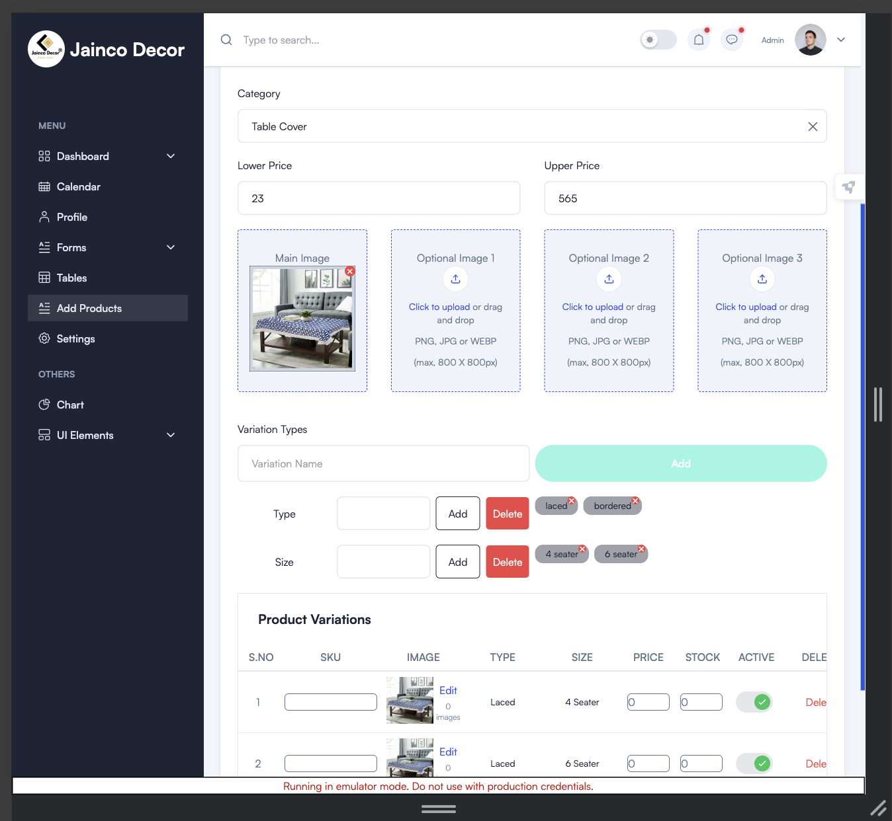
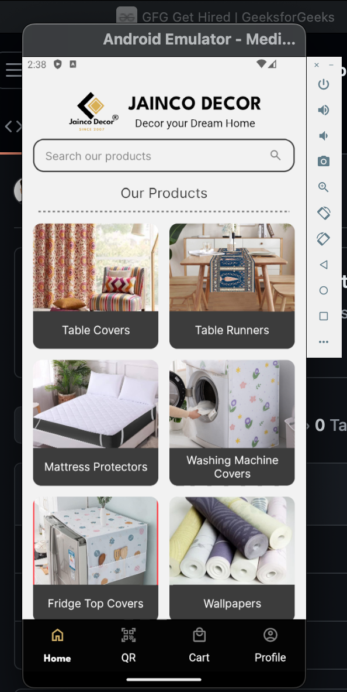
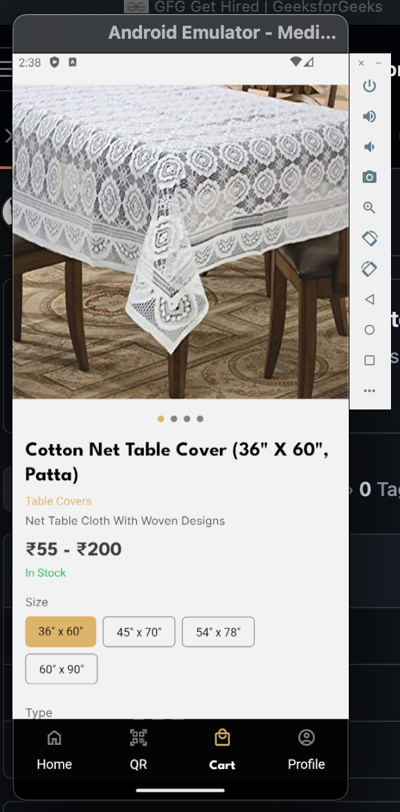

# ERP System for Inventory and Catalog Management (Upcoming Project)

## Overview

This project aims to build a comprehensive ERP (Enterprise Resource Planning) system tailored for inventory and catalog management, designed to meet the needs of businesses of all sizes. The system will consist of a responsive web application and a mobile app, enabling users to manage their inventory and catalogs from any device.

## Technologies Used

- **React.js**: For building a responsive and interactive web application.
- **Firebase**: For real-time database management, authentication, and secure backend services.
- **React Native**: For developing a cross-platform mobile application, primarily targeting Android devices.

## Features

- **Responsive Web Application**: A user-friendly interface built with React.js that adapts seamlessly across various devices.
- **Real-Time Database**: Utilizing Firebase to manage data efficiently and provide real-time updates across the system.
- **Mobile App**: A React Native app that allows users to manage their inventory and catalogs on the go.
- **Scalability and Performance**: The system is designed to handle large datasets and support multiple concurrent users.

## Screenshots

### Web Application (Admin Panel)

### Mobile Application

> **Note:** These screenshots are placeholders. Actual screenshots will be added as the project progresses.

## Source Code
 
 - **App source code**: [Code](https://github.com/mayank1784/jainco-app)

The source code for this project will be made available on GitHub. Stay tuned for updates!

## Upcoming Features

- **Advanced Analytics and Reporting**: Integrate tools to generate detailed reports and analytics.
- **User Roles and Permissions**: Implement role-based access control to enhance security.
- **Offline Capabilities**: Add offline support for the mobile app to allow users to work without an active internet connection.

## Contributing

We welcome contributions to this project. If you're interested in contributing, please refer to our contribution guidelines (to be added soon).

## License

This project is licensed under the MIT License - see the [LICENSE](LICENSE) file for details.

---

Stay updated with the latest progress by following the project on [GitHub](#).

